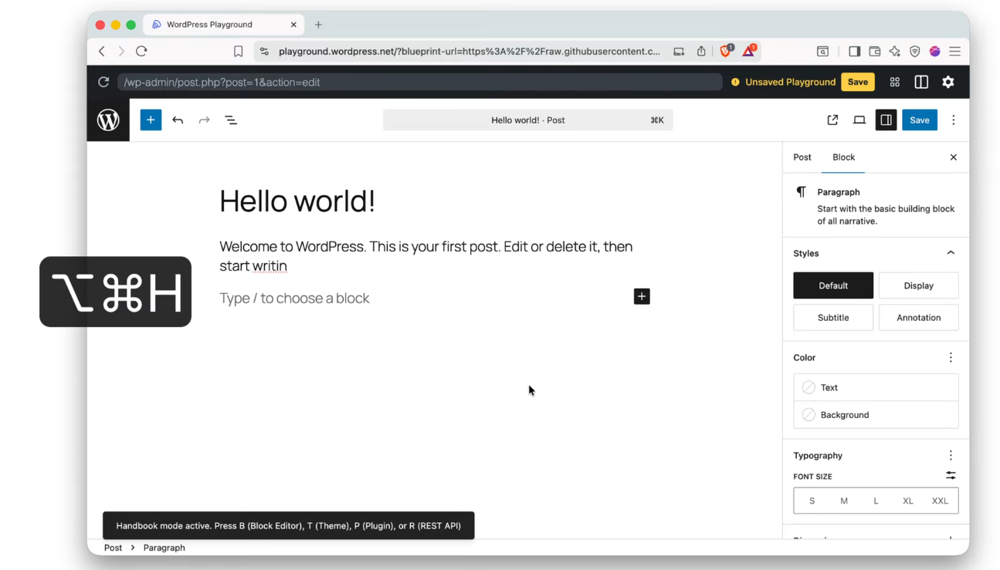
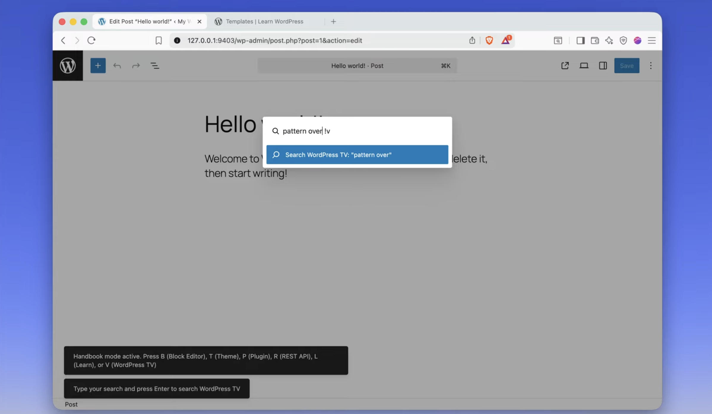

# Search Resources Commands

WordPress plugin for searching WordPress resources (handbooks, Learn WordPress, WordPress TV) via keyboard shortcuts and command palette (see [video](https://youtu.be/je_wUMS5aEc) or [live demo](https://playground.wordpress.net/?blueprint-url=https://raw.githubusercontent.com/juanma-wp/search-handbooks-commands/refs/heads/main/_playground/blueprint.json)).

## Features

- **Keyboard Shortcuts**: Press `Cmd+Option+H` (Mac) or `Ctrl+Alt+H` (Windows) to activate handbook mode, then press:
  - `B` - Search Block Editor Handbook
  - `T` - Search Theme Handbook
  - `P` - Search Plugin Handbook
  - `R` - Search REST API Handbook
  - `L` - Search Learn WordPress
  - `V` - Search WordPress TV

- **Command Palette Integration**: Type search terms followed by prefixes:
  - `!b` - Block Editor
  - `!t` - Theme
  - `!p` - Plugin
  - `!r` - REST API
  - `!l` - Learn WordPress
  - `!v` - WordPress TV

## Installation

1. Clone or download this repository to your WordPress plugins directory
2. Install dependencies: `npm install`
3. Build the plugin: `npm run build`
4. Activate the plugin in WordPress admin

## Development

- `npm start` - Start development mode with hot reload
- `npm run build` - Build for production

## Usage

### Method 1: Keyboard Shortcuts
1. Press `Cmd+Option+H` (activates handbook mode)
2. Press `B` (for Block Editor handbook)
3. Type your search term in the command palette
4. Press Enter to search

### Method 2: Command Palette
1. Press `Cmd+K` to open command palette
2. Type your search term followed by a prefix (e.g., "blocks !b" for Block Editor, "gutenberg !l" for Learn WordPress)
3. Press Enter to search the selected resource

## Requirements

- WordPress 6.0+
- Node.js 14+
- npm or yarn
